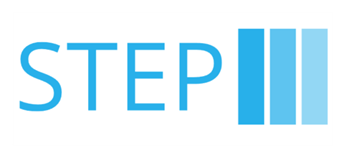

# STEP

A software package that tries to enable objective and accessible balance assessments. It does so by using a Nintendo
Wii Balance board and a Raspberry Pi zero (2)W. 

STEP is a development effort of 4 Master Next Level Engineering students form the University of Applied Science Utrecht.

## Installing / Getting started
1. To setup your own STEP dongle, follow this guide: https://github.com/TimoWalraven/STEP/wiki/How-to-setup-your-own-dongle. 
2. If you already have a preconfigured STEP dongle + balance board, follow this guide: \
(EN): https://github.com/TimoWalraven/STEP/wiki/(EN)-STEP-user-instructions \
(NL): https://github.com/TimoWalraven/STEP/wiki/(NL)-STEP-gebruikershandleiding

## Features

In essence, the STEP package has 3 main features:
* Read center of pressure data from the Wii Balance Board
* Make a recording of the center of pressure data
* Analyze the recording using various algorithms

## Contributing

This repository will probably not be maintained after the end of the project. However, if you want to contribute, you can
do so by creating a pull request. We will review it and merge it if it is a good addition to the project. Here's a list
of things on the development roadmap:
- [ ] Fix some minor bugs
- [ ] Make serial connection more robust
- [ ] Implement guidance on the use of COP variables in a clinical setting 

The projects future is guided by Dr. Jaap Jansen. If you have any questions, you can contact him at:
`Jaap.Jansen@hu.nl`

A conda environment running Python 3.9 was used during development. The environment can be recreated using the
`environment.yml` file or the `requirements.txt` file. To run the STEP interface, run the `backend.py` file.

## Research

The STEP package is the result of a research project. The research report can be found here: \
(EN): *available soon*

## Links

Some useful links:

- Research group: https://www.hu.nl/onderzoek/innovatie-van-beweegzorg

## Acknowledgements

We would like to thank the following people for their contributions to the project:
- Stavros Korokithakis for his blog posts on [how to use the Wii Balance Board as a scale](https://www.stavros.io/posts/use-your-wii-balance-board-as-a-scale-again).
- [Dr. Flavien QUIJOUX](https://scholar.google.com/citations?user=ak3zt7sAAAAJ&hl=fr) for his research and for answering our questions.

## Licensing

This project is licensed under the MIT license. See the [LICENSE](LICENSE) file for more info.
